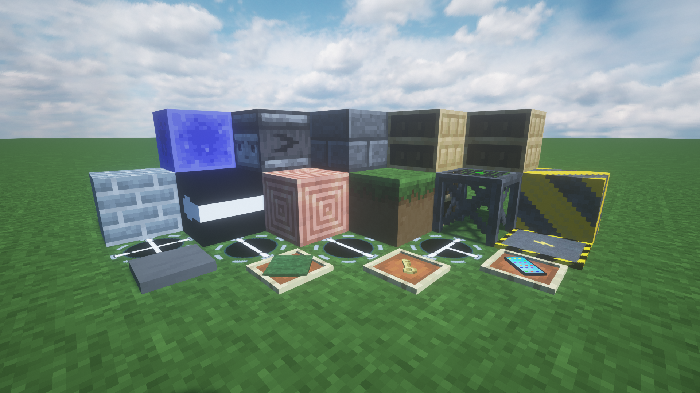

### Installation Requirements

Fabric API is Required

DOWNLOAD ***GitHub Full Release Download Link*** BELOW(Including REI, Fabric API, Mod Texture Addon)

**Important**: In order to be able to see all recipes required in Extra Redstone Craft Mod, consider installing  REI. The vanilla recipe book will not be able to guide you through the experience by itself.

[Fabric API Download Link](https://www.curseforge.com/minecraft/mc-mods/fabric-api)

[REI Download Link]([Roughly Enough Items Fabric... - Mods - Minecraft - CurseForge](https://www.curseforge.com/minecraft/mc-mods/roughly-enough-items))

[GitHub Full Release Download Link](https://github.com/wzsjc2020/Minecraft-Extra-Redstone-Craft-Mod/releases/tag/17.0.5Release)

### About

Hi, everyone! This is Extra Redstone Craft Mod. A mod adding more decoration, redstone and useful utilities. 

All the item added in this mod has been fully considered. This mod does not change vanilla game experiences . It is more likely a addon for Minecraft vanilla. We love this game, and we want to make it better. Redstone components are quite boring in Minecraft vanilla for many year. All we have are piston, slime blocks, redstone  wire. They are good, but tedious.

Create Mod is really good mod. Crafting without GUI, is one of our goal to make game simple. Minecraft really need to change interact mode. We are a little bit tired of old redstone components and old restone gate blocks. We want redstone automate any thing. We surely need a new energy to power those components. That's our goal, to recreate and rebuild a better Minecraft.

This mod is ready to add more content in the future, we will learn form other games, and other mod creators. 

### Wiki

we are working on this！

### Developer

WZSJC2023

### Language Supported

-en_us 	English US

-zh_cn 	简体中文

